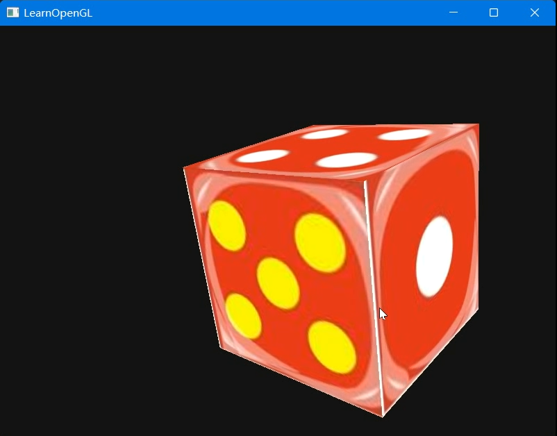
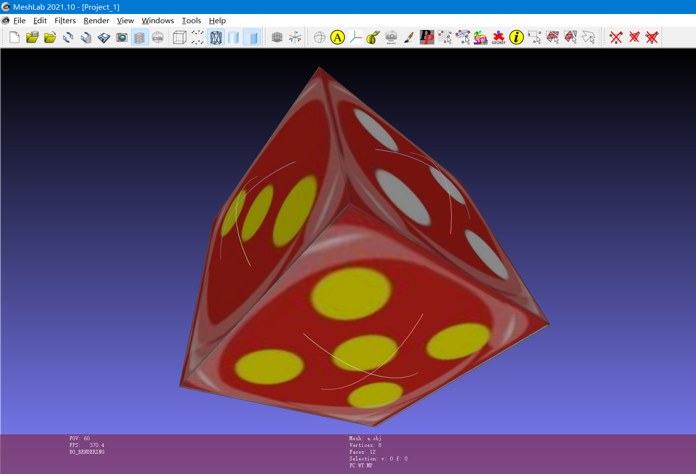

## 实验 0

- 作者：[icy](https://icys.top/)
- 邮箱：[i@icys.top](mailto:i@icys.top)

### 实验目标

1. 读取三角形网格数据文件
2. 使用 OpenGL 绘制该模型(能够对模型进行平移、旋转)
3. 交互设定模型的两个位置和姿态，利用**四元数** (quaternion) 对物体进行平滑的移动和旋转，使得物体在平移过程中能够平滑旋转。

### 实验环境

- `GLAD`
- `GLFW3`
- `GLM`
- `Learn OpenGL`
- `Assimp`
- `Visual Studio 2022`

### 实验情况

- 实验基于了Learn OpenGL的示例，使用了其Assimp的环境，用于读入三角形网格数据文件（故读文件部分是调库并非原创）。
- 实验自行绘制了一个骰子，编写了obj文件、mtl文件。实验分别设置了六个面的坐标、纹理坐标、法向量等，由于选择的纹理图片顺序不合适，在映射的时候进行了调整。
- 实验通过自行设置QWERTYASDFGH共12键的回调，及上下键+-键的回调，分别控制起终点xyz坐标及绕xyz轴旋转角度，选择一个键后按上下键或者小键盘的加减键，可以对相关属性进行调整。
- 实验对于移动的平滑计算方式是$X = X_0 + (X_1 - X_0) \cdot \frac{t_{now}}{t_{interval}}$，slerp的计算方式为$p=\frac{p_0\cdot \sin(\frac{t_{now}}{t_{interval}}\omega)+p_1\cdot \sin\left((1-\frac{t_{now}}{t_{interval}})\omega\right)}{\sin\omega}$。
- 实验设置播放间隔为6秒钟，每隔六秒钟，物体从刚才设置的出发点经过平滑移动和旋转，变换到终点。
- 实验使用了glm库的四元数模块，其中使用了库中的slerp函数（故slerp也是调包），四元数乘法等。

### 实验结果

- 视频见[experiment0.mp4](presentation/experiment0.mp4)。
- 下面是部分截图






### 对实验的理解

- 由于obj文件是自行制作的，包括贴图的对应，让我学到了obj文件的存储格式
  - obj文件的顶点数据，其中包括
    - `v`顶点数据（每个点的3D坐标）
    - `vt`贴图坐标（每行表示一个贴图的坐标，但目前还没有把点和贴图坐标结合在一起，后期定义面的时候会进行关联，另外一个顶点在不同面上是可以关联多个贴图坐标的）
    - `vn`顶点法向（方便进行shading，不过也是一个顶点在一个面上定义了一个法向，一般来说是求关联所有的法向的均值作为顶点的总法向进行shading）等
    - **obj默认是从1开始存储**
  - obj文件的面片数据
    - 面片常用三角面片，但是由于我制作了一个立方体骰子，发现也可以使用多个顶点定义一个面（不过四个点就不一定共面了）。
    - `f`表示face面片，后面可以跟多个顶点的数据，常见的有`a/b/c`形式的，也有只有`a`的形式的，前者表示面片上的a顶点此处关联法向
- 对于obj文件的读入（一开始的做法，由于发现有Assimp库现成工具，该部分被替换，读入obj文件在实验2中仍然用到）。对于上面的数据部分进行归类，注意obj默认从1存储，在数组对齐时进行调整。考虑到c++没有特别合适的split函数，故我参考了[知乎回答](https://www.zhihu.com/question/36642771/answer/865135551)中C++11的正则表达式进行分割（因为定义一个面片其实是不知道有几个顶点的，于是不方便手动分割）。

```cpp
std::regex ws_re("\\s+"); // split the white space
        std::vector<std::string> v(
                std::sregex_token_iterator(tmp.begin(), tmp.end(), ws_re, -1),
                std::sregex_token_iterator());
```

- 实验还复习到了四元数的基本使用、slerp的插值、四元数和旋转矩阵的对应关系等
  - 任意向量$\textbf{v}$沿着单位向量旋转轴$\textbf{u}$旋转$\theta$度之后的$\textbf{v}'$可以使用四元数乘法获得，$v=[0, \textbf{v}]$，$q=[\cos(\frac{1}{2}\theta), \sin(\frac{1}{2}\theta)\textbf{u}]$，$v'=qvq^*=qvq^{-1}$。
  - 四元数和旋转矩阵对应，对$q=[a,b,c,d]$有
    $R = \begin{bmatrix}1-2c^2 & 2bc-2ad & 2ac+2bd \\ 2bc+2ad & 1-2b^2-2d^2 & 2cd-2ab \\ 2bd-2ac & 2ab+2cd & 1-2b^2-2c^2\end{bmatrix}$
  - 要求使用的插值是slerp插值，其实在旋转角度特别小的时候，由于分母需要除以$\sin\omega\approx\omega$，会使得整个数值特别大，我看到网上部分实现是特判了$\omega$，在其较小的时候使用nlerp插值也可以得到很好的效果。
- 本次实验还用到了许多回调函数，如鼠标按键`mouse_button_callback`、键盘按键`key_callback`、鼠标指针移动回调`cursor_position_callback`等，当然前面所说的名字只是一个回调的名字，而设置其回调的函数则为`glfwSetKeyCallback(window, key_callback)`等。

