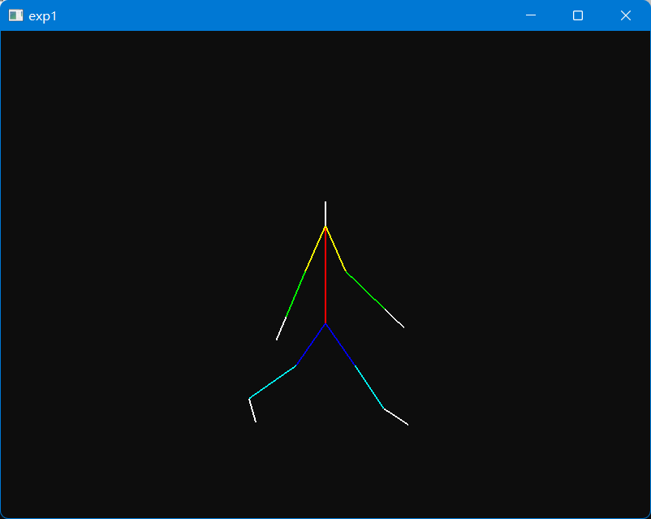
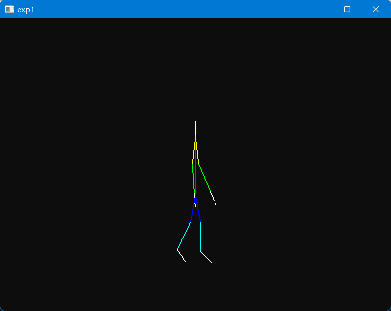

## 实验 1

- 作者：[icy](https://icys.top/)
- 邮箱：[i@icys.top](mailto:i@icys.top)

### 实验目标

- 搭建火柴人，完成火柴人走路动画

### 实验环境

- `glfw3`
- `glm`（使用了其顶点vector、四元数及其相关操作）

### 实验情况

- 实验绘制了一个火柴人，其中有躯干、左右上臂下臂、左右手、左右大小腿、左右脚，对应关节为脖子、左右肩、左右臀、左右肘、左右膝、左右手腕脚腕。
- 实验每2秒播放一次运动动画，按ESC或者关闭窗口停止程序。

### 实验细节

- 实验使用树形结构存储，其中存储的位置是相对于父节点对应部位终部（父节点所在位置+朝向*长度）。
- 实验使用四元数插值，实验存储了每个部位旋转的起终四元数，在时间上进行插值，在于其父节点的旋转结合得到当前节点朝向。
- 实验用火柴人是宽度为2的线段，使用`glBegin(GL_LINES)`绘制。

### 实验结果

- 视频见[video.mp4](presentation/video.mp4)。
- 下面是结果截图

