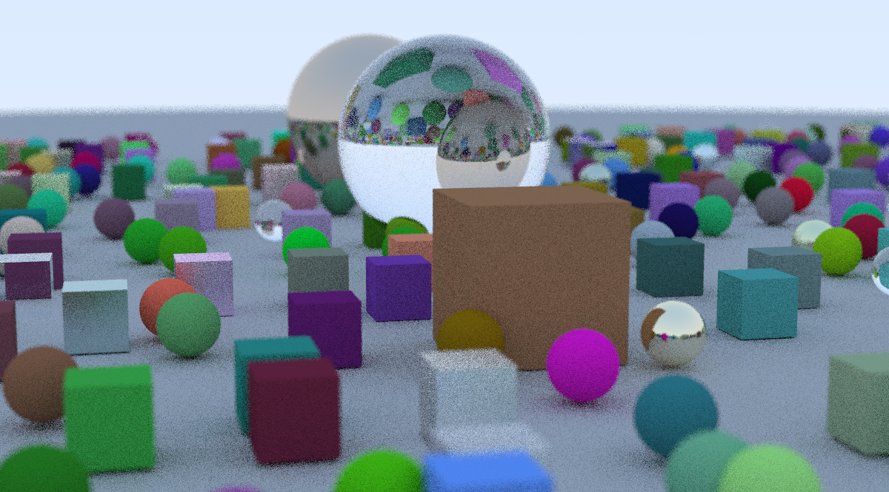

## 实验 2

- 作者：[icy](https://icys.top/)
- 邮箱：[i@icys.top](mailto:i@icys.top)

### 实验目标

- 仿照所给文档实现光线追踪程序

### 实验环境

- 教材所给部分代码环境`RTInOneWeekend`
- `C++11`
- `CMake 3.21.1`

### 实验情况

- 实验基于了光线追踪教材的代码（材料属性、hittable等），并在已有代码基础添加新功能
  - 读入obj文件，并实现在obj的面片上的光线反射折射等
  - 设置AABB包围盒（自己手写，并非实验教材的AABB包围盒），以减小求交次数
- 实验自行绘制了两个obj文件，一个是实验0用的立方体（去除纹理），额外制作了一个四棱锥（`b.obj`）以供实验。

### 实验细节

- 实验首先修改了`hittable`类，添加后期需要使用的`getBounding` （获得所在的AABB包围盒）`getType`（考虑到C++没有Java的反射机制，故需要通过虚函数后binding的方式获得对象的类型）虚函数。
- 实验对于原有的`sphere`类、`hittable_list`类实现刚才定义的虚函数。
- 添加`hittable`的子类`face`、`aabb`，并实现求交`hit`及上述函数。
- 考虑到一个面片可能含有多个点，本实验通过将面片细分为若干三角形，通过判断射线与三角形是否有交点得到面片的结果。射线与三角形求交的方式参考于[知乎专栏](https://zhuanlan.zhihu.com/p/137756970)，其通过求解方程组$P_{E1}u+P_{E2}v-P_Dt=T$得到$u, v, t$的结果，以判断是否存在交点。
- 对于`aabb`包围盒的求交，本实验通过$X_0+t\vec{d}=X_1$得到$t$的计算公式$t_i=\frac{X_1-X_0}{d_i}\quad i\in\{x, y, z\}$。
  - 考虑到射线朝向可能为负，实验将每个轴的$t_{max}, t_{min}$重新调整，再进行相关的判断。
  - 考虑到射线与坐标轴两两形成平面平行的情况，当$\abs{d_i}<10^{-5}$时，不再处理与坐标轴$i$的$t$信息。
  - 设置每个坐标对应的$t_{min}$为`limit`库中的infinity（$t_{max}$设为`-infinity`），然后判断是否有$t_{min}^i > t_{max}^j\quad i\neq j,\ i,j\in\{x,y,z\}$，如果有则与包围盒无交点，若无则$\mathop{\arg\max}\limits_{i}\ t_{min}^i, \quad i\in\{x, y, z\}$轴为最先进入包围盒的边界。
- 修改`hittable_list`的求交方式，若当前物体为AABB包围盒，不应判断为有交，对包围盒内的面片再次进行判断，再检测交的状态。

### 实验结果

- ppm文件见[output2.ppm](presentation/output2.ppm)及[output3.ppm](presentation/output3.ppm)，而`output1.ppm`被覆盖了未保存下来，不过渲染时间由于有AABB包围盒优化时间在20分钟内，可以直接运行获得文件。
- 结果图片如下（图1为无四棱锥的结果，图2为有四棱锥的结果），四棱锥的出现表示着面片的求交是正确的，无法投机取巧的。
- 下面图片通过 [rhodes](https://www.cs.rhodes.edu/welshc/COMP141_F16/ppmReader.html) 网站在线转换得到。

### 对实验的理解

- 实验通过设置不同的光学属性（折射率、颜色吸收率等）来表现各种各样的材料（玻璃、金属、普通物体）。
- 实验有初始的相机，通过相机向各个像素发射光线（光路可逆），再对光线最先映射到的位置再去递归溯源。光线设置了最大迭代次数（如50次），以避免光线在两个物体间反射次数过多。
- 实验使用的ppm图片格式，其实是逐像素的颜色设置，这样的存储方式简单但信息过于冗余，使得获得的图片大小超过20MB。
- 实验中使用了C++11特性`shared_ptr`，这个类似于Java的动态内存管理，当指针指向的内存引用为零会自动回收内存，非常方便。
