# 实验 3

- 作者：[icy](https://icys.top/)
- 邮箱：[i@icys.top](mailto:i@icys.top)

## 实验3-1

### 实验目标

- 绘制贝塞尔曲线

### 实验环境

- `glfw3`
- `glm`（使用了其顶点vector）

### 实验情况

- 实验基于贝塞尔曲线的性质要求，可以将除了起点终点的点作为控制点，也可以分段进行插值求解
- `main.cpp`实现了前者做法（高阶贝塞尔曲线），`main2.cpp`实现了后者做法（多个三阶贝塞尔曲线插值）
- 实验实现了左键点击添加点，右键点击删除点，在点数大于等于3时开始绘制曲线，其中插值做法还通过按键A来使得曲线封闭
- 实验通过按空格键可以显示/隐藏鼠标点击连线

### 实验细节

- 设置鼠标按键和键盘按键回调（在实验0和实验2中均已提及，此处略）
- 维护输入节点列表
- 编写贝塞尔曲线插值代码，对于任意阶曲线都可以进行插值
- 绘制高阶贝塞尔曲线（前者做法）
- 将插值代码进行封装，对于每一段直线$P_{i-1}P_i$计算其控制点。计算公式来自[分段三阶贝塞尔曲线的光滑连续性条件及其WPF应用](https://blog.csdn.net/qq_39031562/article/details/97944197)，公式如下：
  $$C_{i,2} = P_i-\frac{1}{4}(P_{i+1}-P_{i-1})$$ $$C_{i+1,1} = P_i+\frac{1}{4}(P_{i+1}-P_{i-1})$$
- 对于非封闭的曲线，第一段的第一个控制点和最后一段的第二个控制点，根据上述博客，解决方案为$C_{0,1} = C_{0,2}$，$C_{n,1} = C_{n,2}$
- 对于封闭曲线，根据上述博客，便可以把最后几个节点和开始节点放在一起进行处理，以保证起（终）点的连续性。

### 实验结果

- 高阶贝塞尔曲线的绘制

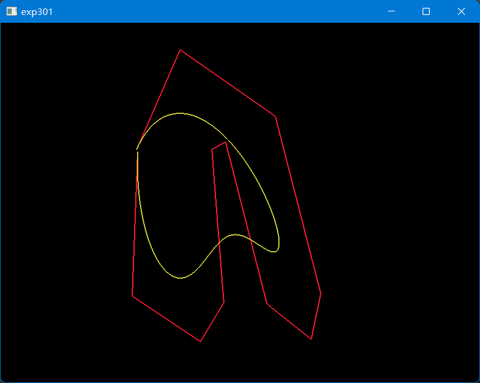

- 贝塞尔曲线插值（封闭曲线，由于设置好了起点终点段的控制点，可见每个点都是光滑的）

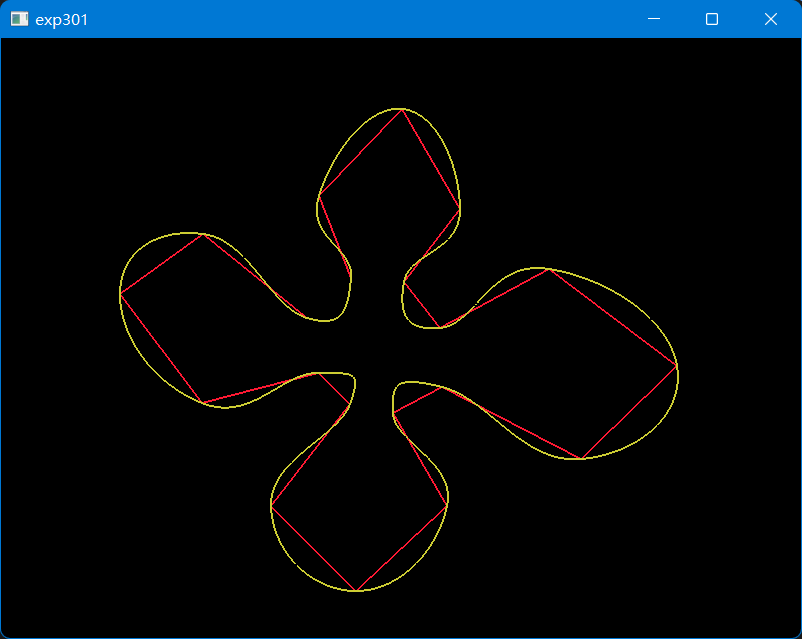

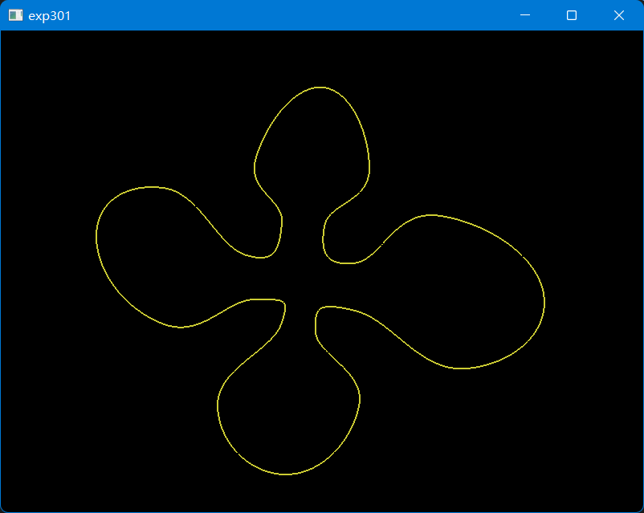

- 贝塞尔曲线插值（不封闭曲线）

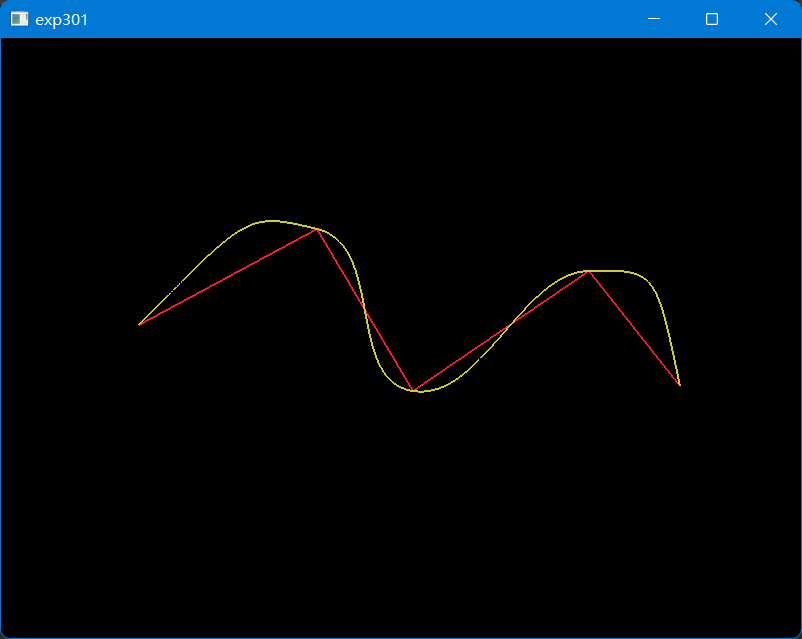

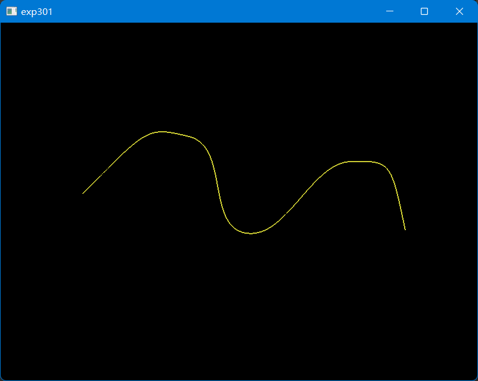

## 实验3-2

### 实验目标

- 绘制线段组合，输出其形成的物体

### 实验环境

- `glfw3`
- `glm`（使用了其顶点vector）

### 实验情况

- 实验输入折线（同实验3-1）后，按空格即可显示生成的物体
- 由于未开启透视投影（使用OpenGL默认的平行投影），得到坐标直接通过Quad Strip画出，故显示的效果其实是平行投影的结果

### 实验细节

- 实验依次获得每个线段，判断得到折线的起点终点，确定旋转轴
- 使用`getDis`函数得到每个点在折线起点为原点旋转轴为y轴的坐标系的坐标
- 将得到的2D坐标的y作为3D坐标的y，将一周$2\pi$细分为120份，每隔3°计算每条线段两顶点在3D物体的位置
- 使用`GL_QUAD_STRIP`模式，连续绘制一系列矩形，形成一条线段的一圈
- 对于每条线段进行上述操作，得到最终的折线的mesh面片组
- 输出obj文件：实验按照obj的格式（实验0已说明），设置点和面的信息，保存到文件中

### 实验结果

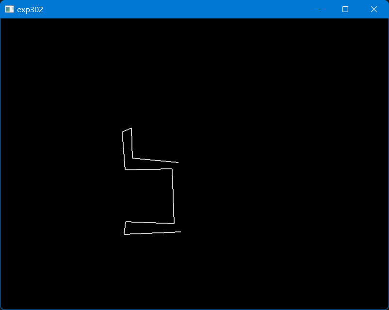

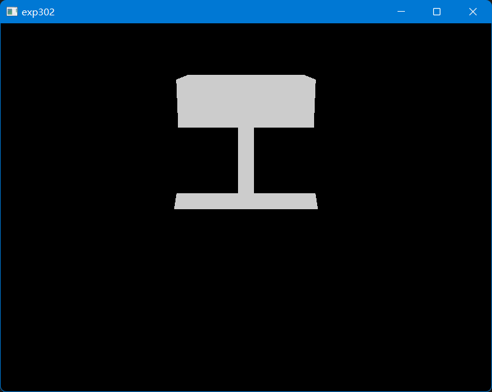

为了更好地展示上图不是一个2D图片，实验补充一个开启线框模式`glPolygonMode(GL_FRONT_AND_BACK, GL_LINE)`，并增大细分粒度，展示结果如下。

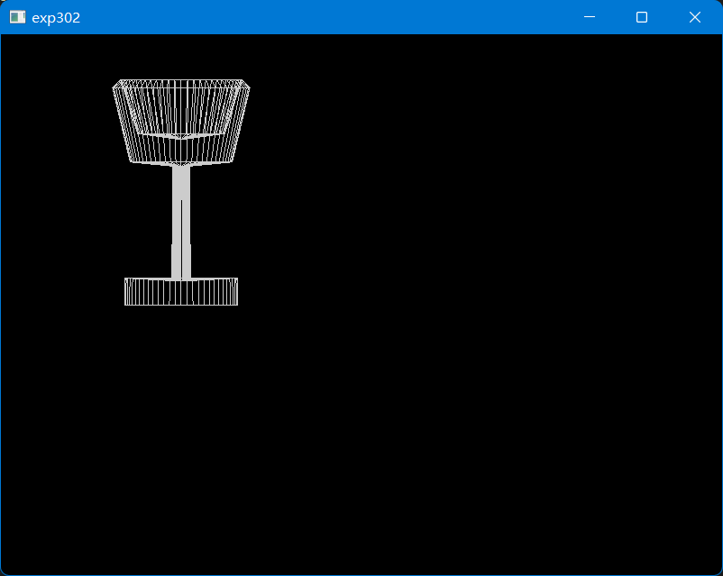

程序计算得到的obj文件见[out.obj](exp302/presentation/out.obj)，图片如下（使用MeshLab打开）。

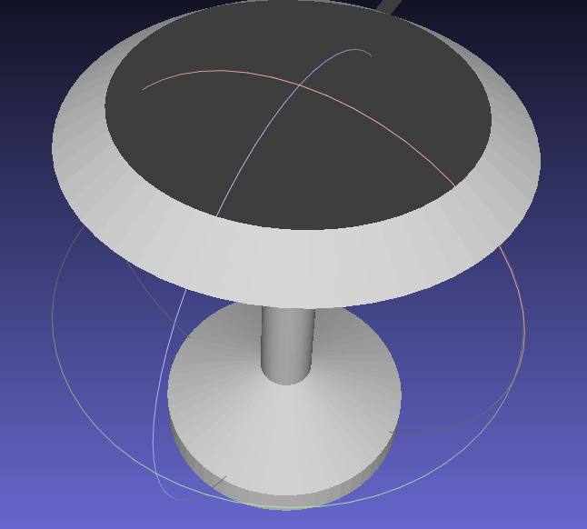

## 实验3-3

### 实验目标

- 对给定平面进行平移，得到平面扫过的体

### 实验环境

- `glfw3`
- `glm`（使用了其顶点vector）

### 实验情况

- 如上述实验，实现了左键点击点，右键删除点形成平面移动轨迹
- 按空格可以得到形成的体，并导出obj文件
- 实验对单面曲面，进行了修补，使得体的所有面的法向都是朝外的
- 对于多段折线的移动，尚未实现隐藏面的消除，导致生成的obj文件中存在较多隐藏面

### 实验细节

- 与实验2相同的，构造相关结构体，读入obj文件
- 获得曲面边缘：mesh中某条边$(x,\ y)$出现在某个面上，而$(y,\ x)$没有出现在平面上则为曲面边缘
- 绘制折线、设置回调函数：同上述实验
- 生成面片：在每个折点处拷贝曲面，并对于曲面边缘进行四边形面片填补
- 输出obj：同实验3-2

### 实验结果

- 实验选取了一个中间带有孔洞的凸曲面
- 下图为平行投影结果

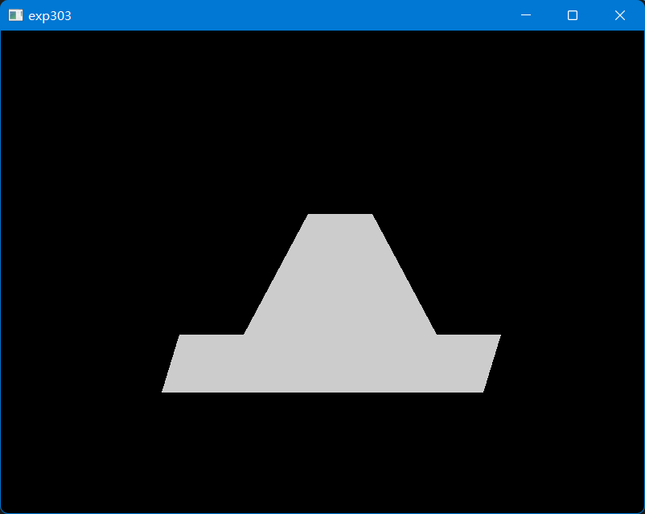

- 下图为设置的原始带孔凸曲面（使用MeshLab打开）

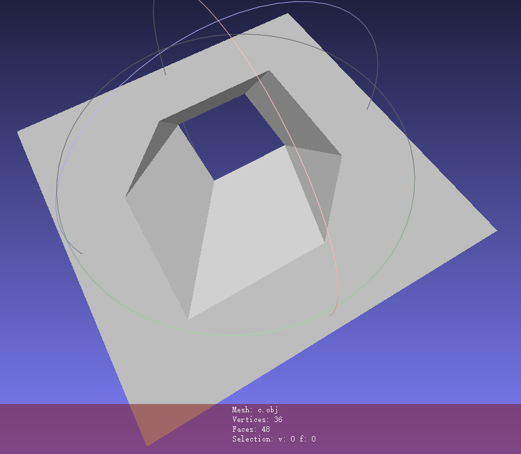

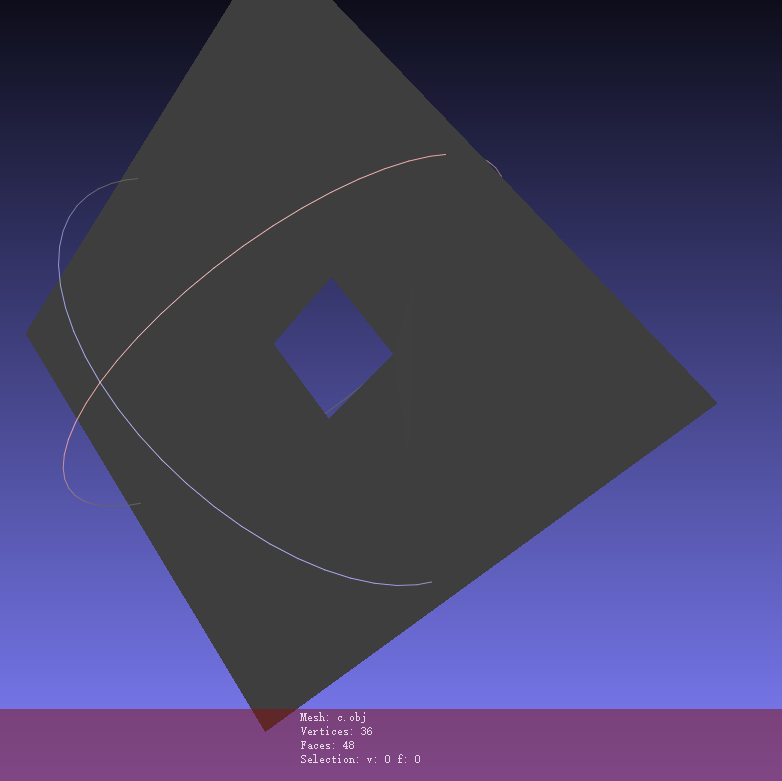

- 下图为生成的结果（使用MeshLab打开）

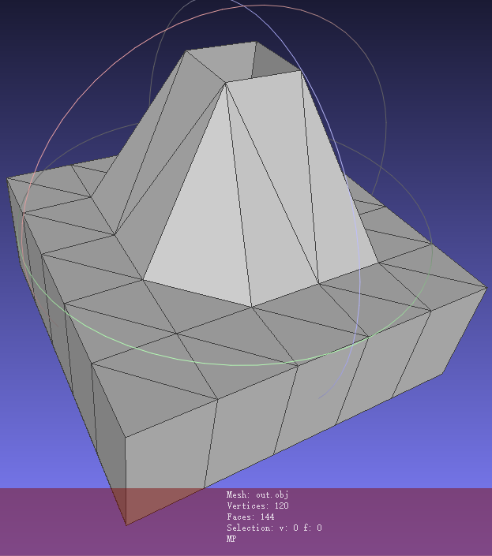

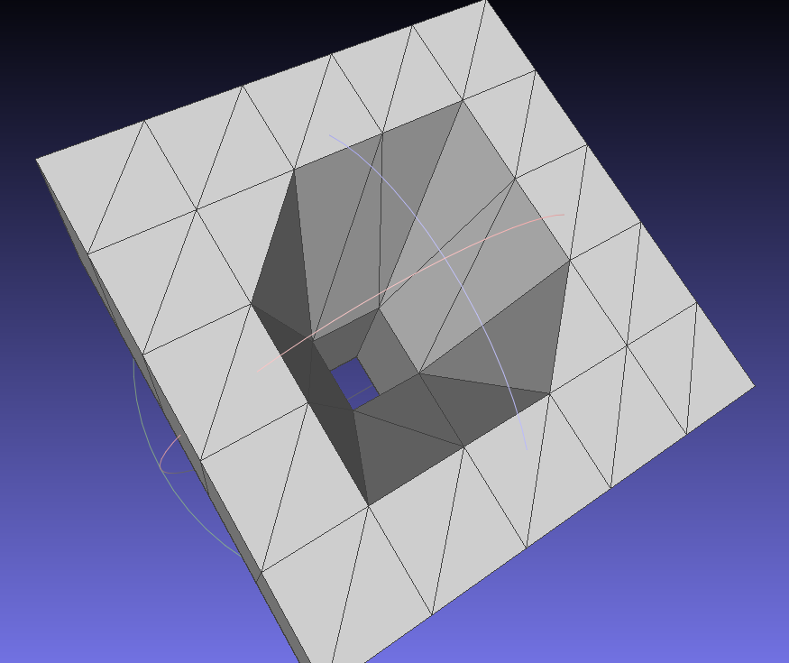
